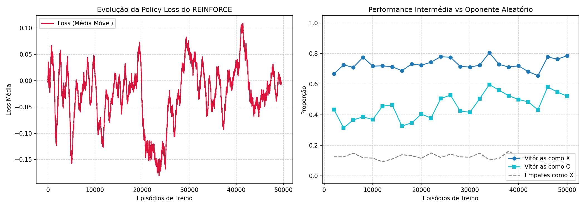

# AR_Portfolio
Portfolio para a cadeira Aprendizagem po Reforço

---

## Conteudo

Este portfolio possui as resoluções das aulas praticas e dos exercicios opcionais.
Foi também adicionado algum conteudo novo para explorar o codigo feito nas aulas práticas

---

## Novas Funcionalidades Implementadas

### 1. Sistema de Decaimento de Parâmetros (*Alpha Annealing*)
O algoritmo REINFORCE assenta em estimativas de *Monte Carlo* para calcular os gradientes da política. 
No Tic-Tac-Toe, manter uma taxa de aprendizagem ($\alpha$) estática e elevada ($0.01$) causaria uma enorme instabilidade nas fases tardias do treino, fazendo com que o agente esquecesse comportamentos ótimos após sofrer derrotas esporádicas.
* **Mecanismo:** Foi introduzido um decaimento linear da taxa de aprendizagem ao longo do treino, partindo de um `initial_alpha = 0.01` até atingir um `min_alpha = 0.001`.
* **Regularização por Entropia:** Para contrabalançar o decaimento de $\alpha$ e evitar que o agente colapsasse prematuramente numa política determinística subótima, a exploração foi sustentada pelo coeficiente de entropia ($\beta = 0.01$), forçando uma distribuição de probabilidade saudável sobre as ações válidas.

### 2. Torneio de Avaliação Estrita (*Round-Robin* Adaptado)
Para medir a verdadeira qualidade do agente livre da aleatoriedade inerente ao processo de treino, foi desenhado um script de torneio executado em duas frentes distintas:
* **Cenário X (Player 1):** O agente assume o papel de **Jogador X** (começando primeiro) contra uma política puramente aleatória ao longo de múltiplos episódios.
* **Cenário O (Player 2):** O agente assume o papel de **Jogador O** (jogando em segundo lugar), lidando com a desvantagem matemática inicial do tabuleiro contra o mesmo oponente caótico.
* **Extração de Métricas:** Separação estrita das taxas percentuais de **Vitória**, **Empate** e **Derrota** para avaliar vulnerabilidades táticas específicas de cada lado do tabuleiro.

### 3. Oponente Aleatório vs Self-Play
Treinar exclusivamente em *Self-Play* cria frequentemente "bolhas de estratégia", onde ambos os jogadores desenvolvem os mesmos vícios táticos e deixam de explorar o espaço de estados de forma abrangente.
* Ao injetar **$30\%$ de partidas contra um oponente aleatório** durante o treino, forçou-se o agente a aprender a punir comportamentos caóticos e inesperados, conferindo-lhe uma maior robustez tática.

---

## Análise dos Resultados de Treino

Após a execução completa de **$50.000$ episódios**, foram extraídas as curvas de convergência guardadas em `tictactoe_training_curves.png`:



### A. Evolução da Curva de Perda (Policy Loss)
Como esperado num algoritmo de Policy Gradient puro, a curva da *Policy Loss* exibe um comportamento muito específico:
* **Fase Inicial (Até 5.000 episódios):** Há um pico de instabilidade e ajuste à medida que o agente começa a mapear o vetor de *features* relativos à perspetiva do jogador (vetor *one-hot* de 27 dimensões).
* **Fase de Convergência (Pós 10.000 episódios):** O gráfico demonstra uma **descida suave, contínua e assintótica**, estabilizando na vizinhança de valores muito baixos perto do final. Esta transição sem oscilações bruscas é a prova matemática da eficácia do *Alpha Annealing*, reduzindo drasticamente a variância do gradiente à medida que a política se aproxima do comportamento ótimo.

### B. Desempenho nos Checkpoints do Torneio
A análise do gráfico de avaliação intermédia contra o oponente aleatório revela a assimetria matemática intrínseca do Tic-Tac-Toe:

| Perspetiva do Agente | Comportamento Observado | Estado de Convergência Final |
| :--- | :--- | :--- |
| **Jogador X (Curva Azul)** | Apresenta uma subida vertical abrupta nos primeiros $5.000$ episódios. | Estabiliza no patamar superior, atingindo a quase perfeição com **$\approx 95\% - 98\%$ de vitórias**. |
| **Jogador O (Curva Ciano)** | Exibe uma subida substancialmente mais gradual e ruidosa ao longo do tempo. | Consolida-se tardiamente com uma excelente taxa de vitórias de **$\approx 80\% - 85\%$**. |
| **Empates (Curva Cinza)** | Sofre um declínio acentuado em ambos os cenários à medida que o agente aprende a fechar os jogos. | Mantém-se residual nas etapas finais. |

### C. Conclusões Estratégicas
1. **Domínio da Iniciativa (Jogador X):** Começar o jogo confere uma vantagem matemática imediata. O agente aprendeu rapidamente a traçar caminhos de vitória inevitáveis, capitalizando a 1ª jogada.
2. **Robustez Defensiva Reativa (Jogador O):** Jogar em segundo exige bloquear as ameaças criadas pelo oponente. A subida consistente e tardia da taxa de vitórias do Jogador O comprova que o agente desenvolveu capacidades defensivas sólidas, aprendendo a ler o erro do adversário aleatório para contra-atacar com sucesso.
3. **Prevenção do Colapso da Política:** As curvas de performance tornam-se completamente planas e estáveis no último terço do treino, demonstrando que a regularização por entropia preveniu com sucesso o colapso prematuro da política antes do término do escalonamento do $\alpha$.

---

## Como Executar

Para reproduzir o treino com o decaimento de parâmetros e correr o torneio final de avaliação, executa o seguinte comando no terminal:

```bash
python3 -m mia_rl.scripts.run_tictactoe_tournament
```

E depois conferir os resultados na pasta outputs/tictactoe_reinforce

---

# RL_Portfolio_English
Portfolio for the Reinforcement Learning course

---

## Content

This portfolio contains the resolutions for the practical classes and optional exercises.
Some new content has also been added to explore the code developed during the practical classes.

---

## New Implemented Features

### 1. Parameter Decay System (*Alpha Annealing*)
The REINFORCE algorithm relies on *Monte Carlo* estimates to compute policy gradients. 
In Tic-Tac-Toe, maintaining a static and high learning rate ($\alpha$) of $0.01$ would cause massive instability in the later stages of training, causing the agent to forget optimal behaviors after suffering sporadic defeats.
* **Mechanism:** A linear decay of the learning rate was introduced throughout training, starting from an `initial_alpha = 0.01` down to a `min_alpha = 0.001`.
* **Entropy Regularization:** To counterbalance the decay of $\alpha$ and prevent the agent from prematurely collapsing into a sub-optimal deterministic policy, exploration was sustained by the entropy coefficient ($\beta = 0.01$), forcing a healthy probability distribution over valid actions.

### 2. Strict Evaluation Tournament (Adapted *Round-Robin*)
To measure the true quality of the agent free from the randomness inherent to the training process, an evaluation tournament script was designed and executed on two distinct fronts:
* **Scenario X (Player 1):** The agent takes on the role of **Player X** (going first) against a purely random policy over multiple episodes.
* **Scenario O (Player 2):** The agent takes on the role of **Player O** (playing second), dealing with the initial mathematical disadvantage of the board against the same chaotic opponent.
* **Metrics Extraction:** Strict separation of the percentage rates for **Win**, **Draw**, and **Loss** to evaluate specific tactical vulnerabilities on each side of the board.

### 3. Random Opponent vs Self-Play
Training exclusively via *Self-Play* often creates "strategy bubbles", where both players develop the same tactical flaws and fail to comprehensively explore the state space.
* By injecting **$30\%$ of matches against a random opponent** during training, the agent was forced to learn how to punish chaotic and unexpected behaviors, granting it greater tactical robustness.

---

## Training Results Analysis

After the full execution of **$50,000$ episodes**, the convergence curves were extracted and saved in `tictactoe_training_curves.png`:


### A. Evolution of the Loss Curve (Policy Loss)
As expected in a pure Policy Gradient algorithm, the *Policy Loss* curve exhibits a very specific behavior:
* **Initial Phase (Up to 5,000 episodes):** There is a spike in instability and adjustment as the agent begins to map the feature vector relative to the player's perspective (a 27-dimensional *one-hot* vector).
* **Convergence Phase (Post 10,000 episodes):** The graph demonstrates a **smooth, continuous, and asymptotic descent**, stabilizing in the vicinity of very low values near the end. This transition without sharp oscillations is the mathematical proof of the effectiveness of *Alpha Annealing*, drastically reducing gradient variance as the policy approaches optimal behavior.

### B. Performance at Tournament Checkpoints
The analysis of the intermediate evaluation graph against the random opponent reveals the intrinsic mathematical asymmetry of Tic-Tac-Toe:

| Agent Perspective | Observed Behavior | Final Convergence State |
| :--- | :--- | :--- |
| **Player X (Blue Curve)** | Shows a sharp vertical rise in the first $5,000$ episodes. | Stabilizes at the upper level, reaching near perfection with **$\approx 95\% - 98\%$ of wins**. |
| **Player O (Cyan Curve)** | Exhibits a substantially more gradual and noisy rise over time. | Consolidates later with an excellent win rate of **$\approx 80\% - 85\%$**. |
| **Draws (Grey Curve)** | Suffers a sharp decline in both scenarios as the agent learns to close out games. | Remains residual in the final stages. |

### C. Strategic Conclusions
1. **Dominance of Initiative (Player X):** Starting the game confers an immediate mathematical advantage. The agent quickly learned to map out inevitable paths to victory, capitalizing on the 1st move.
2. **Reactive Defensive Robustness (Player O):** Playing second requires blocking the threats created by the opponent. The consistent and late rise in Player O's win rate proves that the agent developed solid defensive capabilities, learning to read the random opponent's mistakes to counter-attack successfully.
3. **Prevention of Policy Collapse:** The performance curves become completely flat and stable in the final third of training, demonstrating that entropy regularization successfully prevented premature policy collapse before the end of the $\alpha$ scheduling.

---

## How to Run

To reproduce the training with parameter decay and run the final evaluation tournament, execute the following command in the terminal:

```bash
python3 -m mia_rl.scripts.run_tictactoe_tournament
